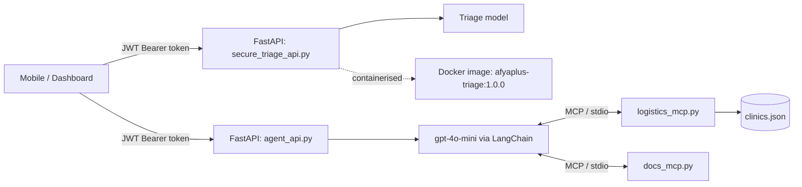

# AfyaPlus Service Platform

A secured, containerised AI service platform for Kenyan clinic supply logistics — built as a self-directed AI Engineering project.

Wraps an AI triage model behind a production-grade FastAPI service, and gives an LLM agent hands: real tools to look up stock, plan delivery routes, and estimate delivery times across five partner clinics — all behind JWT authentication, all traceable, all containerised.

## What this is

AfyaPlus is a scenario modelling a real operational problem: supplying medicine and test kits to five partner clinics across four Kenyan counties. This platform replaces a manual, phone-and-spreadsheet workflow with:

- A **secured triage API** — a model behind a URL, not a script on someone's laptop
- A **containerised deployment** — the exact same environment on any machine
- An **MCP-based logistics agent** — an LLM that can check stock, plan routes, and estimate delivery times by calling real, validated tools, not by guessing

The agent recommends. A human confirms. Nothing moves without both.

## Architecture



## Key features

**Secure API layer**
- JWT authentication: `/token` login, protected routes, role-based permissions (coordinator vs viewer)
- Typed Pydantic request/response models with field-level validation
- Honest failure modes: `401` (who are you), `403` (not for you), `422` (bad input), `429` (rate limited), `503` (dependency down)
- Rate limiting per authenticated user
- Unprotected `/health` for monitoring probes

**Containerisation**
- Slim Python base image, dependency layers cached separately from application code (cold build 77s → cached rebuild 5.3s)
- Secrets injected only at container start via `--env-file`, never baked into the image (verified by inspecting a container's environment directly)
- Image tag (`afyaplus-triage:1.0.0`) matches its Git tag (`v1.0.0`)

**MCP logistics server** (`logistics_mcp.py`)
- Three tools: `check_stock`, `plan_delivery_route`, `get_delivery_eta`
- One resource: the clinic directory
- Every tool validates its input, returns errors as structured data (never crashes), and logs every call
- A second, independent server (`docs_mcp.py`) proves tools compose across servers with zero integration code between them

**Agent, safely**
- LangChain agent over `gpt-4o-mini`, consuming both MCP servers
- Three safety rails: role-based permissions, human-in-the-loop confirmation for any action that changes real data, and idempotency protection against retried requests
- Every request gets a trace id, logged with timing, cost (tokens in/out, model calls), and who asked — reconstructable with a single `grep`
- Tested honestly: a documented transcript where the agent admits its tools cannot answer a question, rather than inventing an answer

## Tech stack

FastAPI · Pydantic · PyJWT · bcrypt · Docker · MCP (Model Context Protocol) · LangChain · LangGraph · OpenAI (`gpt-4o-mini`) · Git

## Project structure

```
afyaplus-platform/
├── secure_triage_api.py       # Layer 1: secured triage API (JWT, rate limiting, roles)
├── auth.py                    # Shared JWT auth module
├── rate_limit.py              # Per-user rate limiter
├── Dockerfile                 # Cache-friendly, slim-base container recipe
├── docker-compose.yml         # Multi-service orchestration
├── deployment.yaml            # Kubernetes deployment reference
├── logistics_mcp.py           # MCP server: stock, routing, ETA tools + clinic resource
├── docs_mcp.py                # Second MCP server: operations policy lookup
├── clinics.json                # Clinic dataset (5 clinics, 4 counties)
├── agent_langchain.py         # LangChain agent wired to both MCP servers
├── agent_api.py               # Authenticated agent endpoint (sessions, tracing, safety rails)
├── honest_agent_test.py       # Evidence the agent admits what it can't answer
├── before.txt / after.txt      # Honest-failure test transcripts
├── CONTRIBUTING.md            # Branching, versioning, and merge-conflict ├── AfyaPlus Service Platform - Engineering Report.md   # Full engineering report
├── cost-optimization/         # Cost model, sensitivity, retry storm, break-even, TCO
├── cloud-platforms/           # Cost-aware Compose, budgets, tags, platform configs
├── performance-optimization/  # Cache and batch levers, quality check, evidence
└── executive-brief/           # API vs self-host memo, executive one-pager (PDF)
```

## Engineering practices demonstrated

- Trunk-based development with short-lived feature branches
- A real merge conflict, deliberately induced and resolved (see commit history)
- Semantic versioning, with image tags matching Git tags
- Request tracing across service boundaries
- Documented, honest evidence of both success and failure modes — including a genuine tool-selection limitation found during testing, not hidden

Full engineering report, architecture rationale, and stakeholder recommendation: see [`AfyaPlus Service Platform - Engineering Report.md`](./AfyaPlus%20Service%20Platform%20-%20Engineering%20Report.md).

## Author

Esther Kamau ([@Eswa2020](https://github.com/Eswa2020)) — self-directed AI Engineering project.

---

## Cost-optimised deployment and executive brief

The triage API from the service platform above, extended with a cost model, cost controls,
two measured optimisation levers, a hosting decision and an executive brief.
**Unit cost: $0.2018 per 1,000 triage requests** (model + infra); $0.3018 including ops time.
Traffic assumption: 2M requests in a normal month, plus a 10× partner spike on one payday
weekend a month (3.2M in that month).

| Deliverable | Where |
|---|---|
| 1. Cost model and $/1k (baseline + spike) | [cost-optimization/cost-model/cost_model.md](cost-optimization/cost-model/cost_model.md), with `tco.py`, `sensitivity.py`, `retry_storm_cost.py` |
| 2. Deploy config and budget alerts | [cloud-platforms/deploy-config/](cloud-platforms/deploy-config/): `docker-compose.cost.yml`, Azure and AWS budget JSON, `budget_alert_notes.md`, `ceiling_tags_checklist.md` |
| 3. Two levers with measurements | [performance-optimization/levers/measurements.md](performance-optimization/levers/measurements.md), transcripts in `evidence/` |
| 4. API vs self-host memo | [executive-brief/api_vs_selfhost.md](executive-brief/api_vs_selfhost.md) |
| 5. Executive one-pager | [executive-brief/one_pager.pdf](executive-brief/one_pager.pdf) (source: `one_pager.md`) |

Supporting material: `cost-optimization/concepts/`, `cloud-platforms/concepts/` and
`performance-optimization/concepts/` hold small runnable demos of each concept.

### How to run
- Cost model: `cd cost-optimization/cost-model`, then `python cost_model.py` and `python tco.py`.
- Service with cost controls: `docker build -t triage-api:1.1.0 .` in the project root, then
  `cd cloud-platforms/deploy-config` and `docker compose -f docker-compose.cost.yml up -d`;
  check `http://127.0.0.1:8000/health`.
- Cache and batch levers: start Redis (`docker run -d --name afya-redis -p 6379:6379 redis:7-alpine`),
  then in `performance-optimization/levers`: `python make_fixtures.py`, `python cache_hitrate.py`,
  `python batch_worker.py seed`, `python batch_worker.py`.

### Levers implemented
1. **Response cache** (exact match, Redis, 10-minute expiry): 60% hit rate on a fixed 100-request
   test set, run cost from $0.2018 to $0.0965 per 1,000, answers unchanged.
2. **Batch queue** for non-urgent work: each job processed and billed once; failing jobs retried
   individually and set aside after 3 attempts.
3. Measured and **not adopted**: a cheaper short-answer path (−65% cost) changed 4 of 20 urgency
   decisions, including one downgrade.

### Budgets and tags
$450/month cap, identical on Azure and AWS, alerts at 80% of actual spend and at a 100% forecast,
scoped to the `service=triage-api` tag. Service labels: service, version, env, cost-center, owner,
and a declared 4-replica ceiling.

### Fallbacks declared
- [x] Paid cloud: none used. Budgets are config-as-submitted JSON; apply was simulated.
- [x] GPU / quantization: none. Simulated with a shorter-answer path on the same model.
- [x] Model: the triage service uses a stub model call; costs are modelled on gpt-4o-mini list
      prices. Live calls were made only for the cheaper-path quality check (40 calls).
- [ ] Redis: not needed as a fallback. Redis was used (local Docker `redis:7-alpine`).
- [x] No load test or latency (p95) measurement, because the model is a stub.

### Version note
`secure_triage_api.py` now reports its model endpoint and model name in `/health`, and its
version in one constant. The image is tagged `triage-api:1.1.0`; `1.0.0` is unchanged.